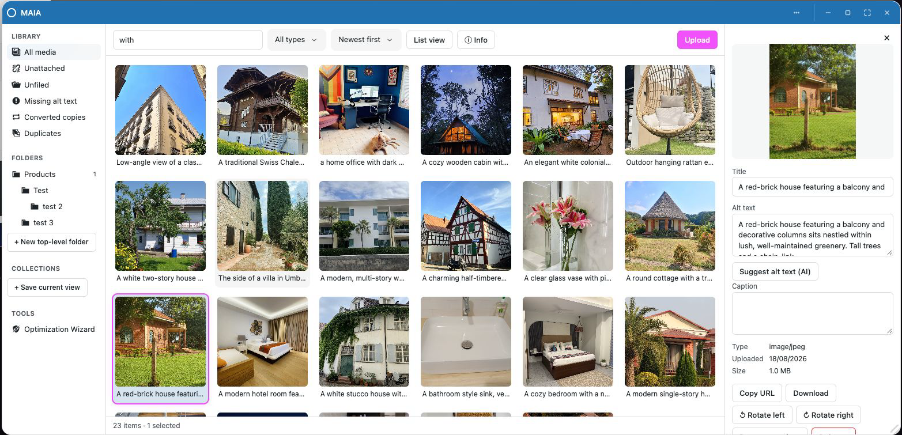
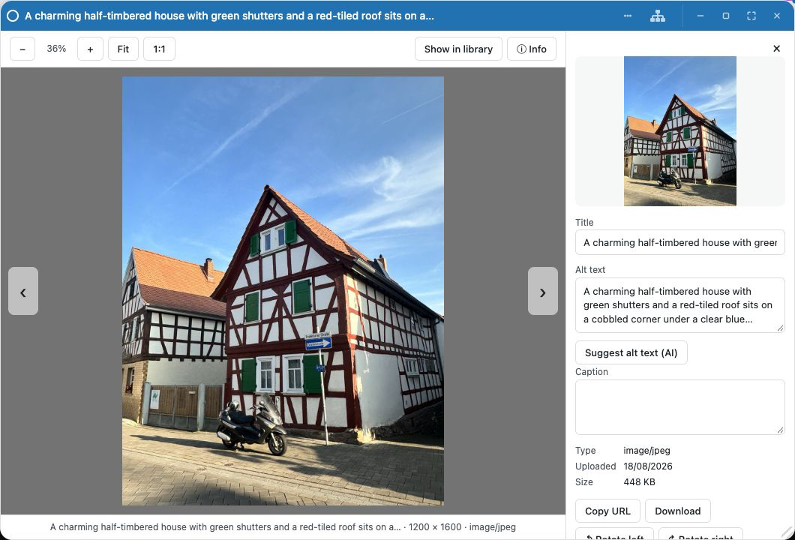
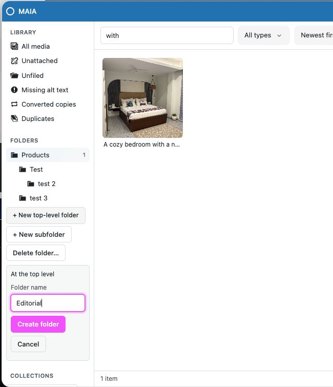
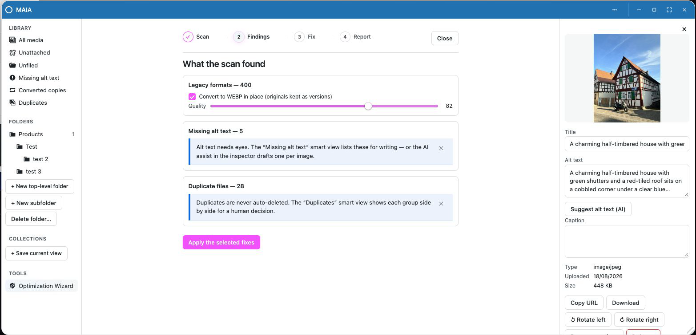

<div align="center">


# MAIA

**A home for every image. Built for WordPress and OpenStation.**

[](https://wordpress.org)
[](https://php.net)
[](https://wordpress.org/plugins/desktop-mode/)
[](LICENSE)

Find it. File it. Make it ready for your next post.

[Get started](#get-started) · [Screenshots](#a-look-around) · [Developers](#development) · [Releasing](docs/releasing.md)

</div>

MAIA brings folders, a dedicated image viewer and practical media tools to the
[OpenStation](https://wordpress.org/plugins/desktop-mode/) desktop. Your existing
WordPress library is already there: organize it, inspect it, convert an image or
restore a previous version without leaving your workspace.

Made by **AllTerrain**, alongside [AllTerrain Forms](https://wordpress.org/plugins/allterrain-forms/)
and [AllTerrain Photo Editor](https://wordpress.org/plugins/allterrain-photo-editor/).
Free software, with no license keys or author-operated cloud service.

## A look around

### A library you can put in order

Drag images into folders and see when they finish saving. Build a folder tree,
keep searches as live collections, or jump to unfiled media, missing alt text,
converted copies and duplicates. The inspector keeps metadata and image tools
close to the selected file.



### Give the image some room

Double-click a photo to open the viewer. Zoom, pan, switch between fit and 1:1,
and move through the library with the arrow keys. Open the info drawer for
metadata, conversion and version tools.



### Folders with a clear destination

**New top-level folder** creates a sibling of Products or any other root, even
while a folder is selected. **New subfolder** goes inside the selected folder.
Names are entered inline using OpenStation controls, with validation and saving
feedback. Deleting a folder preserves its media and moves child folders up one
level.



### A thoughtful library tidy-up

The Optimization Wizard scans for oversized originals, legacy formats, missing
alt text and duplicate files. Review its findings and choose what to fix. Batches
can resume, and converted originals are kept as versions. Duplicates are left for
a human decision; AI alt-text drafting requires a separate confirmation.



## More in the toolbox

- **Format conversion:** JPEG, PNG, WebP, AVIF and GIF where supported. Use your
  host's Imagick/GD or supported browser fallbacks, including bundled AVIF WASM.
- **HEIC intake:** convert iPhone photos to JPEG when the host's Imagick can read HEIC.
- **Restorable versions:** replace an image while retaining its previous original.
  Same-format replacements keep the URL. **Changing format changes the URL**;
  existing embedded links may need updating.
- **Usage information:** see detected references in posts and settings before
  deleting an image. Plugins can report additional usage through hooks.
- **Desktop drag and drop:** move media into compatible OpenStation targets,
  including Gutenberg and other AllTerrain apps.
- **Optional AI alt text:** explicitly send one image's URL, title and caption to
  the AI provider configured in OpenStation, then review the draft. See the
  [external-services disclosure](readme.txt).

## Get started

1. Install and activate [OpenStation](https://wordpress.org/plugins/desktop-mode/).
2. Upload `allterrain-media-explorer.zip` through **Plugins → Add New → Upload Plugin**
   and activate MAIA.
3. Enable OpenStation from the admin bar and open **MAIA** from its dock or shortcut.

Requires **WordPress 6.0+** and **PHP 7.4+**. The classic Media Library remains
available. Folder membership does not move files or change their URLs.
Deactivation preserves data; uninstall removes MAIA's folders, collections,
settings and saved version files, while retaining current media attachments.

The initial WordPress.org submission ZIP is built locally using the commands
below. Directory approval and the final SVN slug must be confirmed before enabling
WordPress.org deployment.

## Development

```bash
npm ci
npm run build:bundles    # build explorer, shell and codec, readable + minified
npm run deploy          # mirror to the sibling Docker QA checkout on port 8889
npm run dev             # watch/rebuild the explorer bundle
npm run typecheck
npm test
npm run test:php         # PHPUnit in the QA container or wp-env
npm run plugin:package  # checks/builds and creates dist/allterrain-media-explorer.zip
```

`npm run build` combines the bundle build and local deployment. Sources are
TypeScript with a plugin-local Vite build. WordPress supplies the PHP APIs; there
is no production Composer dependency. Bundled JavaScript includes exifr (MIT)
and jSquash's AVIF encoder (Apache-2.0); notices ship in `assets/licenses/`.

### Testing

Vitest covers the interface and request lifecycle. PHP integration tests cover
the WordPress data layer and the real OpenStation App Framework. `npm run test:php`
fails if no test backend is available; see [test setup](docs/releasing.md#local-checks)
for wp-env. CI uses a pinned OpenStation framework fixture. The local integration
site is **http://localhost:8889**.

### Releases and artwork

```bash
npm run artwork:build            # export the four directory banner/icon PNGs
npm run plugin:check             # WordPress Plugin Check (needs wp-env)
npm run plugin:release           # build, JS/PHP tests, Plugin Check and ZIP; does not publish
npm run bump-version -- 0.1.1    # update version files only; does not commit or tag
npm run release -- 0.1.1         # publish from main after changelog review and green CI
```

The release helpers follow the same workflow as AllTerrain Photo Editor. Tag
releases attach the ZIP on GitHub; stable tags also deploy to WordPress.org once
approval and SVN credentials are in place. See [the release guide](docs/releasing.md)
for first submission, retries and credentials. Listing artwork and screenshots
are staged separately in `dist/assets/`, never included in the plugin ZIP.

The cream grid, serif wordmark and terracotta/sage palette follow the AllTerrain
family. [Editable artwork and font licenses](docs/artwork/README.md) are included.
The screenshots show the real MAIA interface on the local demo site.

### Plugin integration

MAIA uses OpenStation's **App Framework**, with native registration fallback on
older shells. The product name is MAIA; the existing `allterrain-media-explorer`
slug, text domain, `atme_` prefixes and window identifiers remain stable.

Start with [architecture](docs/architecture.md), [PHP hooks](docs/hooks-reference.md),
[JavaScript](docs/javascript.md), [OpenStation integration](docs/openstation.md)
and [examples](docs/examples/). The [migration and review](docs/review-2026-09.md)
records the review fixes and known limits.

## License

[GPL-2.0-or-later](LICENSE). Font licenses and artwork provenance are documented
in [docs/artwork](docs/artwork/README.md).
