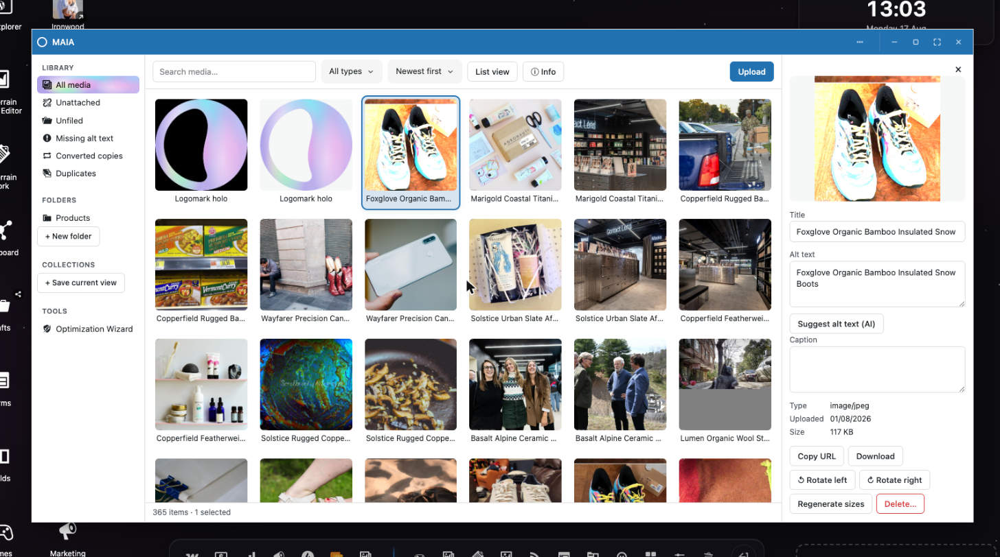
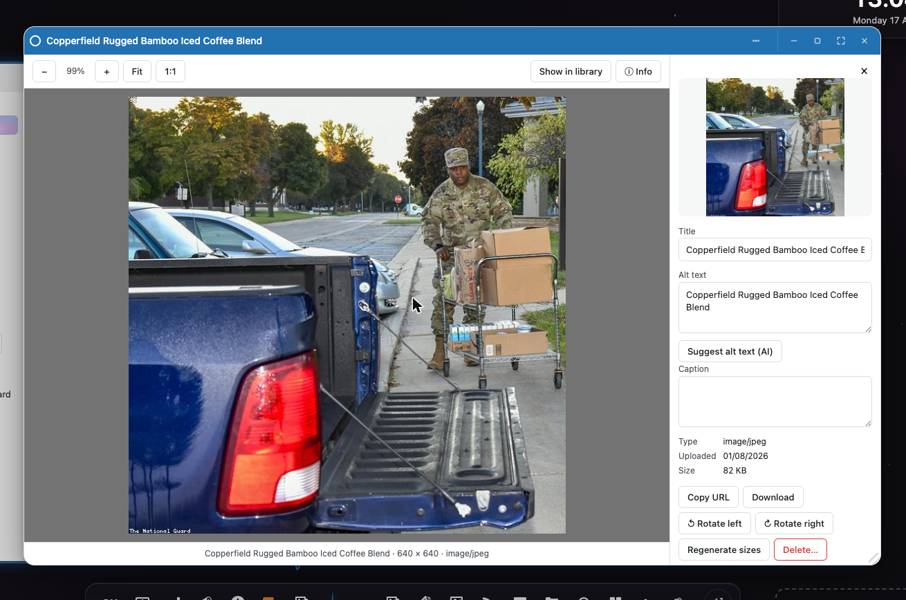
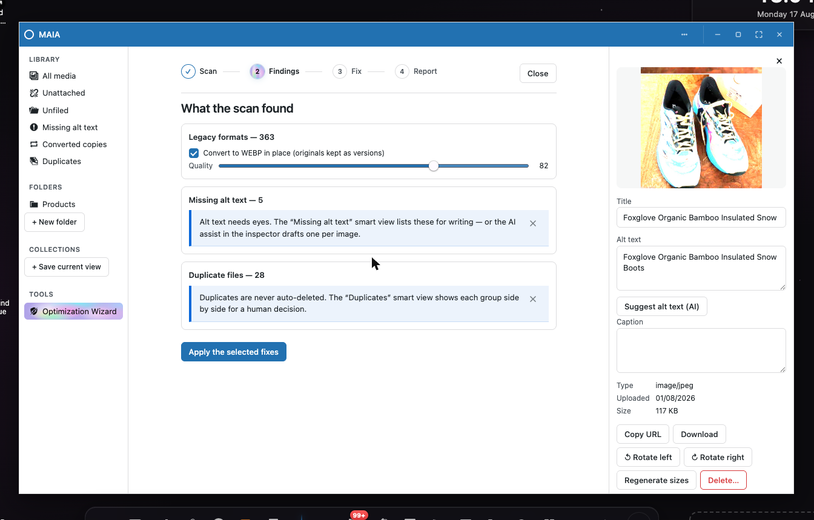
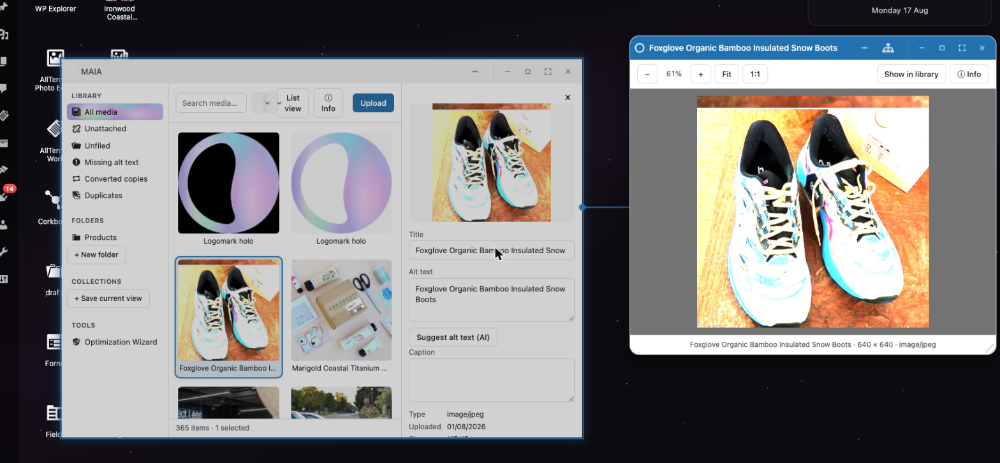

<div align="center">

# MAIA — Media Asset Interface & Administration

**The media library WordPress should have shipped, built as a native
[OpenStation](https://github.com/WordPress/openstation) desktop app.
Part of the AllTerrain family.**

[](https://wordpress.org)
[](https://php.net)
[](https://github.com/WordPress/openstation)
[](LICENSE)
[](#testing)



</div>

---

## What it is

MAIA is a media library that opens as a window on the OpenStation desktop and does
what core's grid cannot: **folders** and saved collections, **format
conversion** (JPEG/PNG/WebP/AVIF, server-side via Imagick/GD or in the
browser via canvas + WASM), **replace-in-place** with restorable versions,
**HEIC intake** for iPhone photos, a resumable **Optimization Wizard**, and
an honest answer to *"where is this file used?"* before anything is
deleted.

And because it is a **native window** — the shell's own DOM, not an iframe
— a photo lifts out of the grid on the shell's drag pipeline and lands in a
Gutenberg post, on an AllTerrain Work card, in an AllTerrain Fields image
field, or in a wallpaper folder. The payload is byte-for-byte the shape WP
Explorer emits, so every existing drop target accepts it with zero new
code.

## A look around

**The viewer.** Double-click anything — a grid tile, a file on the wallpaper
— and the photo opens full bleed: wheel/pinch zoom with panning, fit/1:1,
← / → walks the library, and the ⓘ drawer is the entire inspector, from
EXIF to version rollback.



**The wizard.** Scan the library, see what could be better — legacy formats,
missing alt text, duplicates, oversized originals — pick the remedies, and
watch a resumable batch fix them. Nothing is deleted, everything converted
in place keeps its original as a version.



**Windows that know each other.** Open a photo from the library and the
desktop draws the tie: the viewer declares itself a child of the library
window, and OpenStation's relations engine connects them.



## The decisions

**The name is MAIA; the identifiers are not.** The directory slug, text
domain, `atme_` prefixes, REST namespace (`atme/v1`) and window ids keep
their original `allterrain-media-explorer` spellings — renaming machine
identifiers breaks session restore, file associations, and every site that
installed under them, and buys a rename nothing.

**Everything is a post.** An attachment already is one; folders are a
taxonomy on it, collections are saved-query posts, versions are meta
pointing at real files. No tables, and uninstall removes every trace
without touching a single attachment.

**OpenStation is required.** `Requires Plugins: desktop-mode` — the slug is
the shell's directory name, not its product name. The product *is* the drag
surface; there is no second, lesser UI to rot. Without the shell the data
layer, REST namespace and conversion engine still work, and a signpost page
says where the product lives.

**Nothing destroys pixels without a copy.** Convert makes a sibling unless
asked to replace; replace stashes a version; rollback goes through replace,
so undo has an undo; the wizard never deletes on its own.

## Running it

```bash
npm install
npm run build          # builds explorer/shell/codec bundles + deploys to a sibling QA checkout
npm run dev            # watch mode for the explorer bundle
npm run typecheck
npm test               # vitest (69)
npm run test:php       # PHPUnit in the QA site's container (45)
npm run plugin:package # dist/allterrain-media-explorer.zip
```

No Composer anywhere: PHP dependencies are WordPress plus the host's own
Imagick/GD extensions, probed at runtime; the only bundled third-party code
is [jSquash](https://github.com/jamsinclair/jSquash)'s AVIF encoder
(Apache-2.0, the Squoosh codecs), compiled to WASM and loaded lazily.

## For developers

`docs/` is the contract: [architecture](docs/architecture.md), every
[hook](docs/hooks-reference.md), the [JS surface](docs/javascript.md), the
[OpenStation integration](docs/openstation.md), and copy-paste
[recipes](docs/examples/) — accept a drop, emit a payload, add a smart
view, report your plugin's media usage.

## License

GPL-2.0-or-later.
